# Git工作流
## Git常用工作流
1. 集中式工作流
2. 特性分支工作流
3. Gitflow工作流
4. Fork工作流

## Gitflow工作流
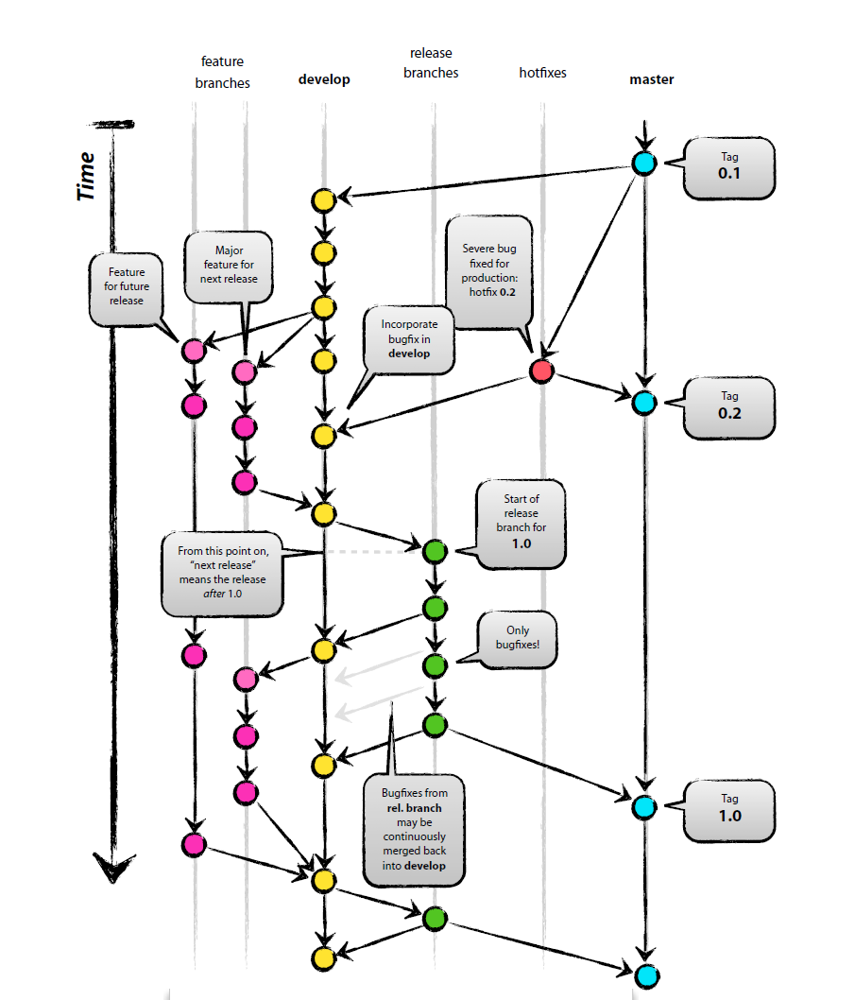
上图为Gitflow工作流的整体流程图

###下面以_"张三"_和_"李四"_两个开发者的操作为例,来看一下Gitflow工作流的具体操作：

1. 首先，_"张三"_克隆远程仓库
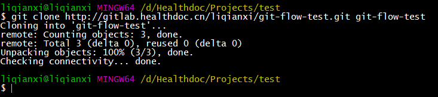
2. _"张三"_本地创建一个**[develop]**分支
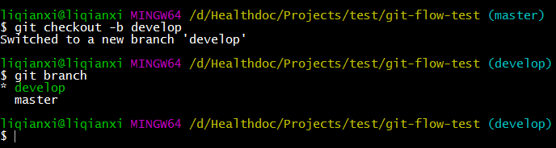
3. _"张三"_将**[develop]**分支推送至远程仓库
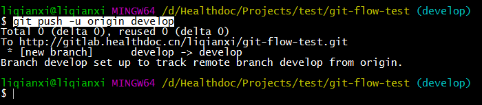
4. _"李四"_将克隆远程仓库
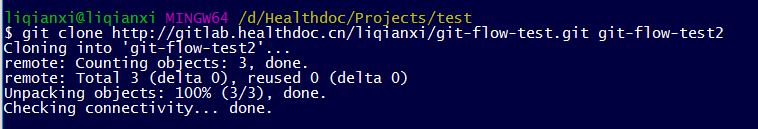
5. _"张三"_开发功能1，从**[develop]**分支发起分支**[z_feature1]**
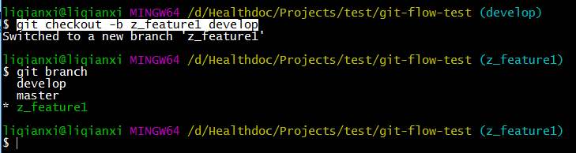
6. _"李四"_开发功能2，从**[develop]**分支发起分支**[l_feature2]**
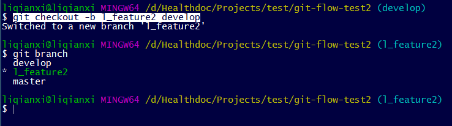
7. _"张三"_在分支**[z_feature1]**开发完功能1后，将更新合并到**[develop]**分支
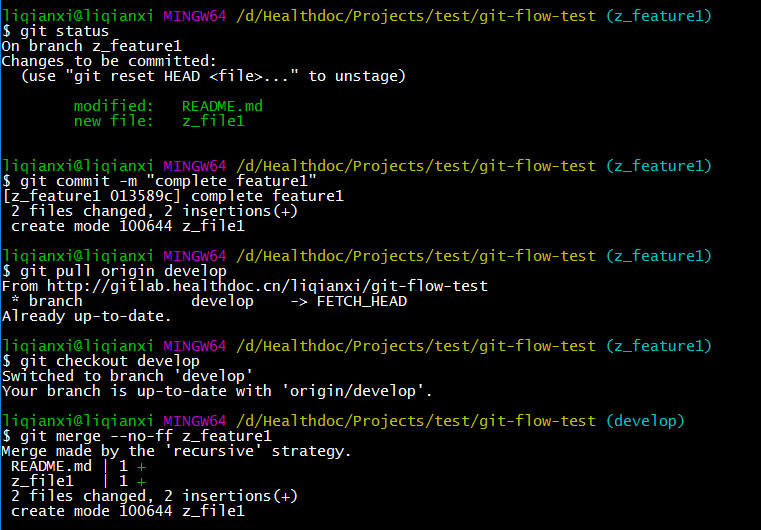
8. _"李四"_在分支**[l_feature2]**开发完功能2后，将更新合并到**[develop]**分支
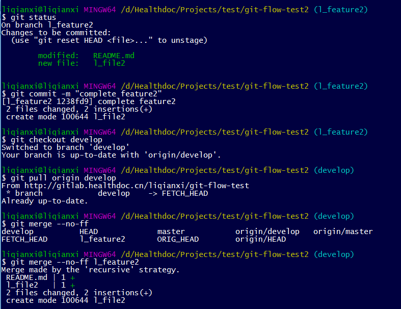
9. _"张三"_将**[develop]**分支推送到远程仓库(可能需要解决冲突)
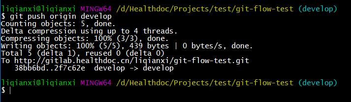
10. _"李四"_将**[develop]**分支推送到远程仓库(可能需要解决冲突)
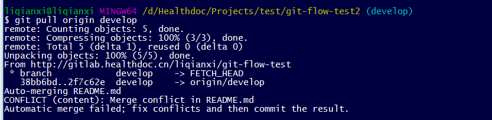
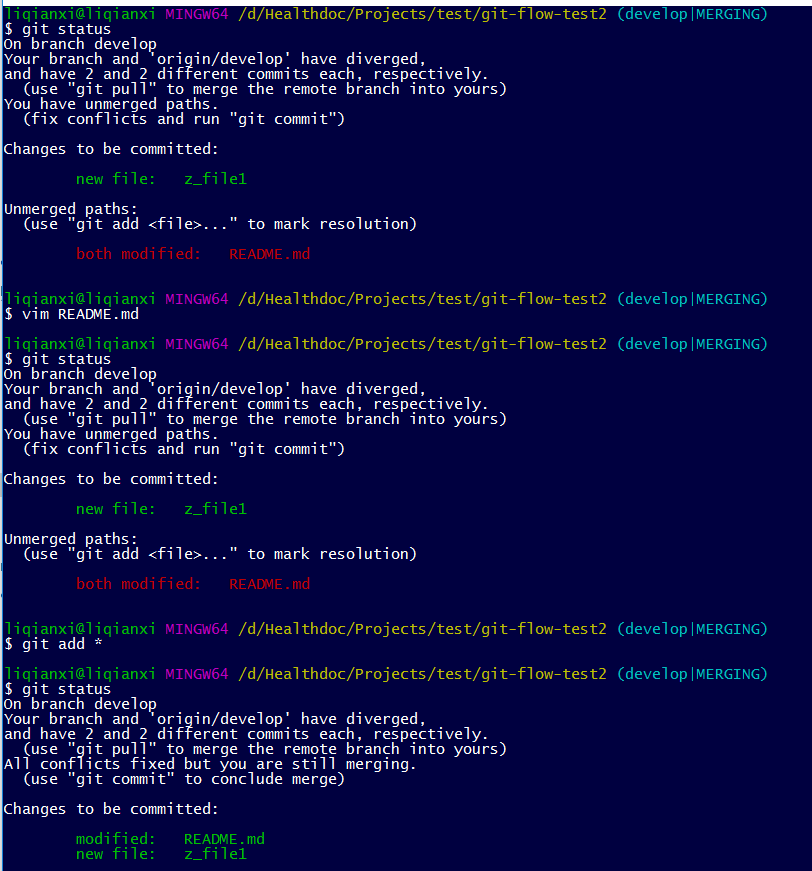
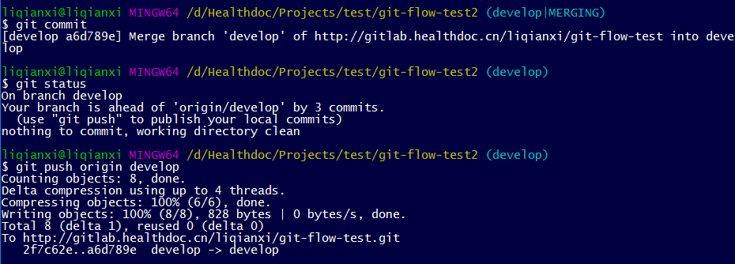
11. 现在，已可以发布新的版本了，_"张三"_从**[develop]**分支发起分支**[release-1]**并推送至远程仓库
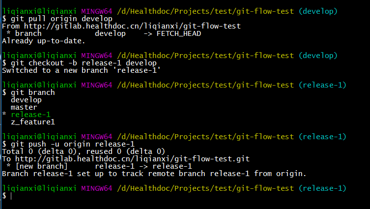
12. _"李四"_接到开发功能3的任务，从**[develop]**分支发起分支**[l_feature3]**
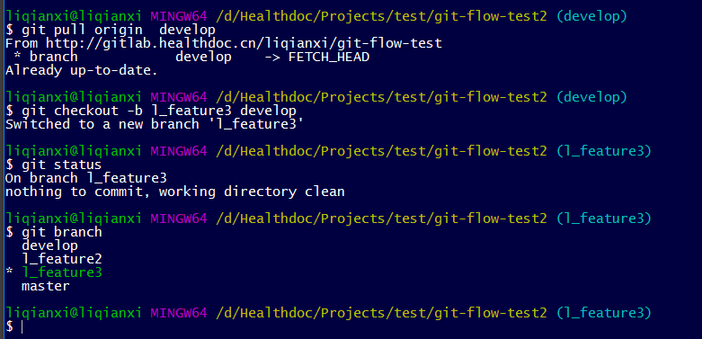
13. _"李四"_在分支**[l_feature3]**开发完功能3后，将更新合并到**[develop]**分支
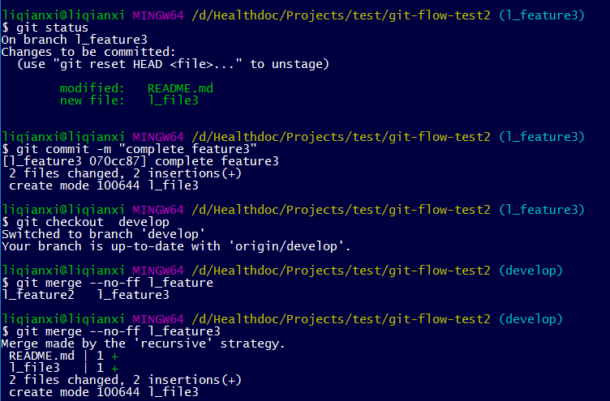
14. _"李四"_将**[develop]**分支推送到远程仓库(可能需要解决冲突)
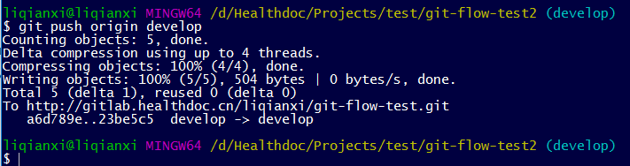